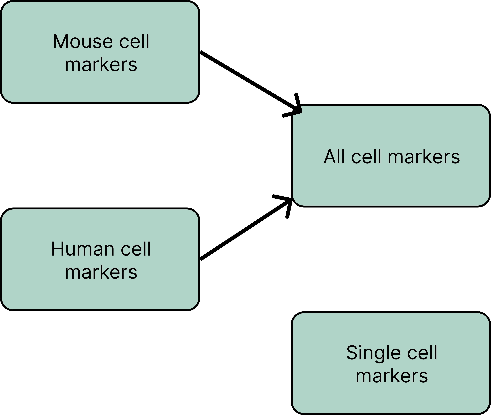

<!-- PROJECT LOGO -->
 

<h3 align="center">CellMaker_DataParser</h3>

  

    This repo contains code that parses raw CellMarker_Data into a JSON file that Dumper can use in Biothings Studio.
     
    

<!-- TABLE OF CONTENTS -->

  
Table of Contents

  <ol>
    <li>
      <a href="#about-the-project">About the dataset</a>
    </li>
    <li>
      <a href="#getting-started">Dataset Features</a>
    </li>
    <li><a href="#usage">Data Processing Workflow</a></li>
    <li><a href="#contact">Contact</a></li>
    <li><a href="#acknowledgments">Acknowledgments</a></li>
  </ol>

<!-- ABOUT THE PROJECT -->
## About the dataset

[![Product Name Screen Shot][product-screenshot]](https://example.com)

About this dataset:
The dataset can be found [here](http://xteam.xbio.top/CellMarker/download.jsp). These records contain data about molecules expressed on the surface, within, or secreted by cells. These markers are used to identify and classify the types, states, or functions of cells within a population. 

### Dataset Schema
There in total 4 different different Cell_Marker Dataset but all of them have the same attributes.
- **speciesType**: the species from which the data originates
    - there are only two data type, either `Human` or `Mouse`
- **tissueType**: the type of tissues from which data originates
    - in total 181 different kinds of cells
    - a lot of them are undefined
- **UberonOntologyID**: The universal unique identifier of the anatomy structure found in animals 
    - needs to confirm with the team
    - contain missing value and most of them are missing due to undefined tissueType
- **cancerType**: the association of the cell marker with the cancer name
    - if the cell Marker does not represent cancer, then it is named as `Normal`
- **cellName**: the English name of the cell that the marker belongs to
- **CellOntologyID**: The universal unique identifier of the cell that the marker belongs to
    - contain missing value
- **cellMarker**: a marker molecule of the cell
    - in string like list, can be converted to a list
- **geneSymbol**: gene expression of the cell marker
    - in string like list, can be converted to a list
- **geneID**: The universal unique identifier of the gene
    - in string like list, can be converted to a list
    - contain missing value
- **proteinName**: name of the protein
    - in string like list, can be converted to a list
    - contain missing value
- **proteinID**: The universal unique identifier of the protein
    - in string like list, can be converted to a list
- **markerResource**: the type of resource or methodology used to identify the marker
    - there are only four data types, either `Experiment` or `Single-cell sequencing` or `Company` or `Review`
- **PMID**: The PudMed ID for the publication or study where the marker data was reported
    - if the `markerResource` is  value company, the the value here is contains `company`
- **Company**: the company associated with the resources
    - most of them are missing and only exist when the `markerResource` is Company

### Data Set relationships

<!-- Dataset Features -->
## Dataset Features
This section will discuss some of the features of the data set. All of the work can be found in the ([Jupyter Notebook](https://github.com/g7xu/CellMaker_DataParser/blob/main/eda/all_cell_eda.ipynb)) in the EDA folder.

<!-- Data Processing Workflow -->
## Data Processing Workflow

<!-- CONTACT -->
## Contact

Guoxuan Xu - [@github_profile](https://github.com/g7xu) - g7xu@ucsd.edu

<!-- ACKNOWLEDGMENTS -->
## Acknowledgments

* Apperciate Dr. Wu and Jason Lin for the help!
